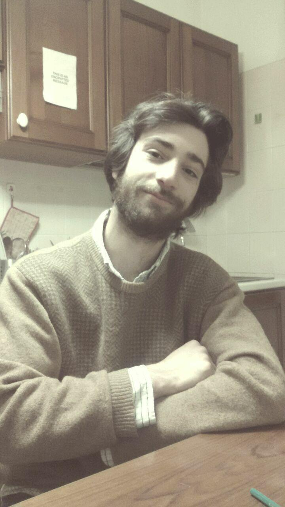

   
#Life
  
  I was born in Tuscany the 7th of November 1994. 
  
  Second of four siblings, I spent the first part of my life in a very little town called Belforte (literally: strong and beautiful) where I discovered the wonders of the nature and the animals. 
  
  My days there circled around few activities: going to school, playing football, playing the cello, and chasing my dream of becoming a magician. Also, I used to read lots of books, many more than what I manage to read now.
  
 Led since I rembember by a deep curiosity about people, minds, behaviours, and their evolution, after the high school I undertook the path of Psychology and left home for the first time: one of the best Univeristies in Italy had accepted my application!
  
  University gave me much clearer formulations for my questions, but very few answers regarding the mind and the counsciosness; but in that period I also realized the importance of the scientific method, and decided to takle the issue from an evolutionary point of view. 
  

  
#Study
    
  In September 2017 I obtained my BA degree in Social Psychology at University of Padua with an experimental thesis on   2D-3D face recognition, result of the work carried out with the [FaceLab](facelab.org). 
  
  Since after that I am working in that same Lab for my MSc in Research Methods of Psychological Science, at University of Glasgow.

  My current research focuses on the understanding of how humans recognise their kin. More specifically, what kind of cues in the face let others to assest the relatedness between two individuals.
  

  
  
#Contact
  
   [2356605q@student.gla.ac.uk](2356605q@student.gla.ac.uk)
  
 <a href="https://orcid.org/0000-0003-1603-6019" target="orcid.widget" rel="noopener noreferrer" style="vertical-align:top;">orcid.org/0000-0003-1603-6019</a>
 
     
 
  
 
 
 
  
 
 
 
 All logos from [Elegant Themes](https://www.flaticon.com/packs/elegant-font) under a Creative Commons (CC 3.0) license.