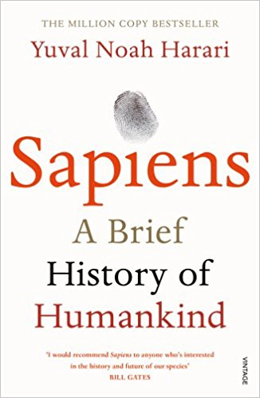
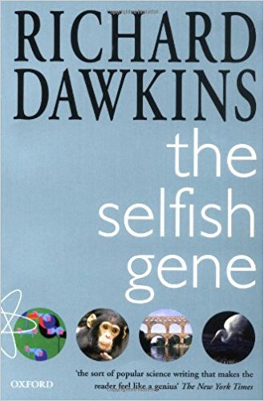

       
       
#Books Top 3:

       
### [Phi: a voyage from the brain to the soul](https://www.amazon.co.uk/Phi-Voyage-Brain-Giulio-Tononi/dp/030790721X) -  [Giulio Tononi](http://integratedinformationtheory.org/):

One of my favourite books ever: Tononi delves into the mysteries of the mind with an allegorical voyage that sees Galileo Galilei as protagonist and that retraces Dante's Divine Comedy in more than a point of view.

Each chapter narrates an encounter, a dialouge, and a reflection. Then, the author himself takes the word in the final notes, explaining in plain English what the characters could not.

The book is meant to export to the broad public Tononi's theory of counsciousness and it is finely tweaked up to the smallest detail.

### [Sapiens: a brief history of humankind](https://www.amazon.co.uk/Sapiens-Humankind-Yuval-Noah-Harari/dp/0099590085/ref=tmm_pap_swatch_0?_encoding=UTF8&qid=&sr=) - [Yuval Noah Harari](http://www.ynharari.com/)

"Prof. Harari originally specialized in world history, medieval history and military history. His current research focuses on macro-historical questions such as: What is the relationship between history and biology? What is the essential difference between Homo sapiens and other animals? Is there justice in history? Does history have a direction? Did people become happier as history unfolded?" (from his [blog](http://www.ynharari.com/))

I find fascinating Harari's work and his way of analysing and questioning the life, especially the concept of happiness. This book explains in a simple language extremely complex concepts, and in doing that results clear and intriguing. 

I am half-way through the second part of this work: [Homo Deus: a brief history of tomorrow](https://www.amazon.co.uk/Homo-Deus-Brief-History-Tomorrow/dp/1784703931/ref=sr_1_1?ie=UTF8&qid=1511913094&sr=8-1&keywords=homo+deus).

       
###[The selfish gene](https://www.amazon.co.uk/Selfish-Gene-Richard-Dawkins/dp/0192860925) - [Richard Dawkins](https://en.wikipedia.org/wiki/Richard_Dawkins)

This milestone of evolutionary theory was my first approach to the matter and it deeply shaped my way to look at the world and the animals, homo sapiens included. 

It was written in 1989, but most of the ideas that it proposed (or their future formulation) are accepted and used broadly in the scientific community. 

Dawkins was the first that proposed the idea of a gene-centered view in the evolution and this is the book that any student, regardless of their subject, should read at some point in their life. 

(Library pic by Annie Spratt ©, all books covers from the relative Amazon.uk page.)
