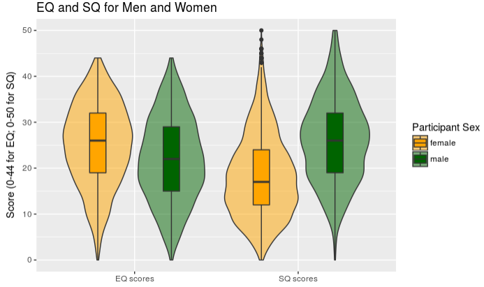

```{r opts, echo = FALSE}
#suppress the warnings and other messages from showing in the knitted file.
knitr::opts_chunk$set(
  fig.width  = 8, 
  fig.height = 5, 
  fig.path   = 'images/coursework1/',
  echo       = TRUE, 
  warning    = FALSE, 
  message    = FALSE
)
```

# Data

Data in the files [empathizing.csv](https://rgup.gitlab.io/research_cycle/data/empathizing.csv) and [systemizing.csv](https://rgup.gitlab.io/research_cycle/data/systemizing.csv) are responses to the short forms of the [Empathizing and Systemizing Quotient short forms](https://doi.org/10.1016/j.paid.2006.03.017).

The variable `user_id` is the participant's unique ID, while the variable `id` is a unique ID for that questionnaire completion. Some participants completed both questionnaires on the same day, others only completed one, others completed the questionnaires multiple times. The columns `starttime` and `endtime` contain the timestamps for when each questionnaire was started and completed.

*Scoring*: An individual scores two points if they strongly display a systemizing/empathizing response, and one point if they slightly display a systemizing/empathizing response (i.e., each forward (F) item scored 2, 1, 0, 0; each reversed (R) item scored 0, 0, 1, 2). 

In the data files, responses were coded as follows:

* 1 = Strongly agree
* 2 = Slightly agree
* 3 = Slightly disagree
* 4 = Strongly disagree

## Empathizing (EQ-Short)

q2663, F, I can easily tell if someone else wants to enter a conversation.
q2664, F, I really enjoy caring for other people.
q2665, R, I find it hard to know what to do in a social situation.
q2666, R, I often find it difficult to judge if something is rude or polite.
q2667, R, In a conversation, I tend to focus on my own thoughts rather than on what my listener might be thinking.
q2668, F, I can pick up quickly if someone says one thing but means another.
q2669, R, It is hard for me to see why some things upset people so much.
q2670, F, I find it easy to put myself in somebody else’s shoes.
q2671, F, I am good at predicting how someone will feel.
q2672, F, I am quick to spot when someone in a group is feeling awkward or uncomfortable.
q2673, R, I can’t always see why someone should have felt offended by a remark.
q2674, F, I don’t tend to find social situations confusing.
q2675, F, Other people tell me I am good at understanding how they are feeling and what they are thinking.
q2676, F, I can easily tell if someone else is interested or bored with what I am saying.
q2677, F, Friends usually talk to me about their problems as they say that I am very understanding.
q2678, F, I can sense if I am intruding, even if the other person doesn’t tell me.
q2679, R, Other people often say that I am insensitive, though I don’t always see why.
q2680, F, I can tune into how someone else feels rapidly and intuitively.
q2681, F, I can easily work out what another person might want to talk about.
q2682, F, I can tell if someone is masking their true emotion.
q2683, F, I am good at predicting what someone will do.
q2684, F, I tend to get emotionally involved with a friend’s problems.

## Systemizing (SQ-Short)

q2616, F, If I were buying a car, I would want to obtain specific information about its engine.
q2617, F, If there was a problem with the electrical wiring in my home, I’d be able to fix it myself.
q2618, R, I rarely read articles or web pages about new technology.
q2619, R, I do not enjoy games that involve a high degree of strategy.
q2620, F, I am fascinated by how machines work.
q2621, F, In math, I am intrigued by the rules and patterns governing numbers.
q2622, R, I find it difficult to understand instruction manuals for putting appliances together.
q2623, F, If I were buying a computer, I would want to know exact details about its hard disc drive capacity and processor speed.
q2624, R, I find it difficult to read and understand maps.
q2625, R, When I look at a piece of furniture, I do not notice the details of how it was constructed.
q2626, R, I find it difficult to learn my way around a new city.
q2627, R, I do not tend to watch science documentaries on television or read articles about science and nature.
q2628, F, If I were buying a stereo, I would want to know about its precise technical features.
q2629, F, I find it easy to grasp exactly how odds work in betting.
q2630, R, I am not very meticulous when I carry out D.I.Y.
q2631, F, When I look at a building, I am curious about the precise way it was constructed.
q2632, R, I find it difficult to understand information the bank sends me on different investment and saving systems.
q2633, F, When travelling by train, I often wonder exactly how the rail networks are coordinated.
q2634, R, If I were buying a camera, I would not look carefully into the quality of the lens.
q2635, R, When I hear the weather forecast, I am not very interested in the meteorological patterns.
q2636, F, When I look a mountain, I think about how precisely it was formed.
q2637, F, I can easily visualize how the motorways in my region link up.
q2638, R, When I’m in a plane, I do not think about the aerodynamics.
q2639, F, I am interested in knowing the path a river takes from its source to the sea.
q2640, R, I am not interested in understanding how wireless communication works.


# Assignment

Answer the following questions by editing the code block below each question.

Note: please enter the *code* that generates the correct answer; don't simply type in the numbers.  The code should give the right answers even if the source data files change (new rows of values are added or subtracted).

In this RMarkdown file:

+ *DO NOT* install/update/remove any packages
+ *DO NOT* set your working directory
+ *DO NOT* use the `View()` function
+ *DO NOT* reference any help functions or package vignettes.

You will be penalized if your file includes any of the above features or any other code that is unnecessary for answering the question, or that produces undesireable side effects.

Setup block.  Load any add-on packages you need here.  

```{r setup}

## loading packages
library(tidyverse)

```

## Loading and inspecting files

1. Load in the two CSV files directly from the web (use the URLs above).  How many times were the empathizing and systemizing questionnaires completed? Save these as the variables:

    * `emp_total_n` 
    * `sys_total_n`

```{r P1}

## loading data
emp <- read_csv("https://rgup.gitlab.io/research_cycle/data/empathizing.csv")
sys <- read_csv("https://rgup.gitlab.io/research_cycle/data/systemizing.csv") 

emp_total_n <- nrow(emp)
sys_total_n <- nrow(sys)
```

## Calculating durations

How long did it take people to complete each questionnaire? 

2. Create the following variables:

* `mean_emp` = mean duration (in seconds) for empathizing questionnaire (before exclusions)
* `sd_emp` = SD of duration (in seconds) for empathizing questionnaire (before exclusions)
* `mean_sys` = mean duration (in seconds) for systemizing questionnaire (before exclusions)
* `sd_sys` = SD of duration (in seconds) for systemizing questionnaire (before exclusions)

```{r P2}

## adding columns for duration in each dataset 
emp <- emp %>%
  mutate(
    duration = as.integer(endtime - starttime)
  )

sys <- sys %>%
  mutate(
    duration = as.integer(endtime - starttime)
  )

## creating variables for means and sds
mean_emp <- mean(emp$duration)

sd_emp <- sd(emp$duration)

mean_sys <- mean(sys$duration)

sd_sys <- sd(sys$duration)

```

3. Graph the distributions for each questionnaire after excluding times that are more than 3 SDs above the mean for each questionnaire.

```{r P3}

## creating a new table for each questionnarie containg only data to plot
emp_graph <- emp %>%
  filter(duration < as.integer(mean_emp + 3*sd_emp)) %>%
  select(user_id, duration) %>%
  mutate(questionnaire = "EQ")

sys_graph <- sys %>%
  filter(duration < as.integer(mean_sys + 3*sd_sys))%>%
  select(user_id, duration) %>%
  mutate(questionnaire = "SQ")

## binding and plotting 
graph <- bind_rows(emp_graph, sys_graph)

graph %>%
ggplot(aes(duration, fill = questionnaire))+
  geom_density(alpha = 0.5, na.rm = TRUE)+
  labs(title = "Duration for EQ and SQ", x = "Duration (sec)", y = "Density", fill = "Questionnaire")
```

## Questionnaire completion

4. How many people completed both questionnaires *for the first time* on the same day? Save this number as  `first_time_n`.

**Remember to check for people who completed a questionnaire more than once.**

```{r P4}

## selecting only the first time (ft) that a questionnaire is completed by each user_id
ft_emp <- emp %>%
  group_by(user_id) %>%
  filter(starttime == min(starttime))


ft_sys <- sys %>%
  group_by(user_id) %>%
  filter(id == min(id))


## putting tables together, making sure to keep `starttime`, `endtime` and `duration` for both questionnaires
## then selecting only questionnaires completed in the same day 
## `starttime` is preferred to `endtime` to avoid excluding questionnaires completed few minutes after midnight
first_time_n <- inner_join(ft_emp, ft_sys, by = c("user_id", "sex", "age"), suffix = c("_emp", "_sys")) %>%
  group_by(user_id) %>%
    filter(as.Date(starttime_emp) == as.Date(starttime_sys))
```

## Respondent demographics

5
. Create a table of demographic information by sex with the columns 
`sex`, `n`, `mean age`, `sd age`, and `number missing age`, only for people who completed both questionnaires for the first time on the same day (i.e., use the data table you created for question 4). Save the table as `demog_table`.
```{r P5}

## pretty much straightforward
demog_table <- first_time_n %>%
  group_by(sex) %>%
    summarise(
      n = n(),
      "mean age" = mean(age, na.rm = TRUE),
      "sd age" = sd(age, na.rm = TRUE),
      "number missing age" = sum(is.na(age))
      )
```

6. What is wrong with the SD? Address it by changing implausible ages to `NA` and re-calcuating the table above, saving it as `demog_table_fixed`.

```{r P6}

## taking off weird ages, the re-calculating
first_time_n$age[first_time_n$age < 9 | first_time_n$age > 99] <- NA

demog_table_fixed <- first_time_n %>%
  group_by(sex) %>%
  summarise(n = n(),
          "mean age" = mean(age, na.rm = TRUE),
          "sd age" = sd(age, na.rm = TRUE),
          "number missing age" = sum(is.na(age)))
```

## Exclusions

If someone takes less than 30 seconds to fill out the questionnaire or gives  the same reponse for every question, we can assume they aren't taking the study seriously.  

7. Filter out non-serious responders. Store the resulting data in the variable named `emp_sys_cleaned`.  You will use this as the source table in later problems.

```{r P7}

## new table for each questionnarie storing people who gave always the same answer
nonserious_emp <- first_time_n %>%
  select(user_id:duration_emp) %>%
  gather("emp_q", "emp_a", q2663:q2684) %>%
  group_by(user_id) %>%
  summarise(diff_answer_emp = n_distinct(emp_a)) %>%
  filter(diff_answer_emp == 1)
  
nonserious_sys <- first_time_n %>%
  select(user_id:age, id_sys:duration_sys) %>%
  gather("sys_q", "sys_a", q2616:q2640) %>%
  group_by(user_id) %>%
  summarise(diff_answer_sys = n_distinct(sys_a)) %>%
  filter(diff_answer_sys == 1)

## let's keep them all together
to_remove <- full_join(nonserious_emp, nonserious_sys) 


## taking off monotonous participants from the main table, then filtering out also the hasty ones
emp_sys_cleaned <- anti_join(first_time_n, to_remove, by = "user_id") %>%
                   filter(duration_emp >= 30 & duration_sys >= 30)
```

8. Create the following variables:
 
- `excluded_short` = How many people took less than 30 seconds on at least one questionnaire? 
- `excluded_one` = How many people gave the same response to each question in at least one questionnaire?
- `excluded_total` = How many people are you excluding in total?
    
```{r P8}

## storing the number of hasty participants as integer value
excluded_short <- first_time_n %>%
  filter(duration_emp < 30 | duration_sys < 30) %>%
  nrow()

## same for monotonous   
excluded_one <- to_remove %>%
  nrow()

## total removed (somebody was in both)
excluded_total <- anti_join(first_time_n, emp_sys_cleaned) %>%
  nrow()
```
    
    
9. Write up your exclusion criteria and numbers of participants excluded as if for the methods section of a paper.  Use inline code to generate any numbers used in your description; don't just type them.

-*-*-*-*- do not delete

### Exclusion Criteria ###

Two criteria have been adopted to discriminate and exclude participants who did not take the study seriously: 
(a) participants who took less than 30 seconds to complete at least one questionnaire and
(b) participants who gave the same response to each question in at least one questionnaire.

Criterium (a) excluded `r excluded_short` participants, while criterium (b) `r excluded_one`.
Since someone was excluded by both criteria, the total n of participants excluded from the study is `r excluded_total`

-*-*-*-*- do not delete

## Create EQ and SQ scores

Calculate the EQ and SQ scores from the questionnaire responses.
    
Remember that forward coded (F) questions are coded: 
    
(1) strongly agree = 2
(2) slightly agree = 1
(3) slightly disagree = 0
(4) strongly disagree = 0
    
while reverse-coded (R) questions are coded: 
    
(1) strongly agree = 0
(2) slightly agree = 0
(3) slightly disagree = 1
(4) strongly disagree = 2

10. Create a table of mean EQ and SQ by sex and save it as `EQ_SQ_scores`. Include the columns `sex`, `n`, `mean_EQ`, `mean_SQ`, `missing_EQ`, and `missing_SQ` (how many people have a missing score).

```{r P10}

## gathering all the forward-coded questions...
frw <- emp_sys_cleaned %>%
  select(user_id, sex, age,  q2616, q2617, q2620, q2621, q2623, q2628, q2629, q2631, q2633, q2636, q2637, q2639, q2663, q2664, q2668, q2670, q2671, q2672, q2674:q2678, q2680:q2684)


## ... and all the reverse-coded questions
rev <- emp_sys_cleaned %>%
  select(user_id, sex, age, q2618, q2619, q2622, q2624:q2627, q2630, q2632, q2634, q2635, q2638, q2640, q2665, q2666, q2667, q2669, q2673, q2679) 

recode(frw, "1" = 2)

, `2` = "1", `3` = "0", `4` = "0"

## changing answers' values according to the table of coding 
## ("t" is used to avoid the 1s to be changed in 2s and then in 1s again)
frw[frw == 1] <- "t"
frw[frw == 2] <- 1
frw[frw == 3] <- 0
frw[frw == 4] <- 0
frw[frw == "t"] <- 2

rev[rev == 1] <- 0
rev[rev == 2] <- 0
rev[rev == 3] <- 1
rev[rev == 4] <- 2


## putting all the answers back together and re-arranging in proper order
EQ_SQ_scores <- inner_join(frw, rev) %>%
  select(user_id, sex, q2663, q2664, q2665, q2666, q2667, q2668, q2669, q2670:q2672, q2673, q2674:q2678, q2679, q2680:q2684, q2616, q2617, q2618, q2619, q2620, q2621, q2622, q2623, q2624:q2627, q2628, q2629, q2630, q2631, q2632, q2633, q2634, q2635, q2636, q2637, q2638, q2639, q2640) 


## summing scores for each user_id in EMPATHIZING QUESTIONNAIRE (EQ)...
EQ_scores <- EQ_SQ_scores %>%
  select(user_id:q2684) %>%
  gather("q", "a", "q2663":"q2684") %>%
  group_by(user_id, sex) %>%
  summarise(
   score_EQ = sum(as.integer(a))
  )


## ...and in SYSTEMIZING QUESTIONNAIRE (SQ)
SQ_scores <- EQ_SQ_scores %>%
  select(user_id, sex, q2616:q2640) %>%
  gather("q", "a", "q2616":"q2640") %>%
  group_by(user_id, sex) %>%
  summarise(
    score_SQ = sum(as.integer(a))
  )
  

## joining EQ and SQ and creating the table of mean
EQ_SQ_scores <- inner_join(EQ_scores, SQ_scores) %>%
group_by(sex) %>%
  summarise(
    n = n(),
    mean_EQ = mean(score_EQ, na.rm = TRUE),
    missing_EQ = sum(is.na(score_EQ)),
    mean_SQ = mean(score_SQ, na.rm = TRUE),
    missing_SQ = sum(is.na(score_SQ))
  )
```


11. Write code to re-create the following graph of the EQ and SQ score distributions for men and women. 



```{r P11}

## creating table with both scores of each user_id
## taking off those with unknown sex since are not included in the graph
scores_table <- inner_join(EQ_scores, SQ_scores) %>%
rename("EQ scores" = score_EQ, "SQ scores" = score_SQ) %>% ## this is for the labels 
  gather("questionnaire", "score", "EQ scores":"SQ scores") %>% ## EQ/SQ need to be a variable to be plotted
  filter(!is.na(sex))

## creating the graph
## edit: I can't believe it worked!  
scores_table %>%
  ggplot(aes(questionnaire, score, fill = sex)) +
  geom_violin(trim = TRUE, alpha = 0.5, na.rm = TRUE) +
  geom_boxplot(position = position_dodge(width = 0.9), width = 0.2, na.rm = TRUE) + 
  scale_fill_manual(values = c("orange", "darkgreen")) +
  labs(title = "EQ and SQ for Men and Women", x = "", y = "Score (0-44 for EQ; 0-50 for SQ)", fill = "Participant Sex") 
```

