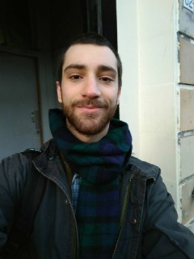

 
       
I am a postgraduate student in the University of Glasgow's
[Institute of Neuroscience and Psychology](http://www.gla.ac.uk/researchinstitutes/neurosciencepsychology/).

I work with [Lisa DeBruine](https://github.com/debruine)

#Study

  2017 - Now [Research Methods in Psychology] (https://www.gla.ac.uk/postgraduate/taught/psychologicalscienceresearchmethodsof/) at University of Glasgow 

  2013 - 2017 [Social & Organizations Psychology] (http://didattica.unipd.it/off/2016/LT/PS/PS1085) at University of Padua, Italy.

  2008 - 2013 [Science High School] (http://www.liceovolta.org/) in Colle Val d'Elsa, Italy.

#Reseach Interest

  I obtained my BA degree in Social Psychology at University of Padua in September 2017, with an experimental thesis on   2D-3D face recognition result of the work carried out in the [FaceLab](facelab.org). I am now working in that same Lab for my MSc in Research Methods of Psychological Science, within the KINSHIP project.

  My current research focuses on the understanding of how humans recognise their kin. More specifically, what kind of cues in the face let others to assest the relatedness between two individuals.
