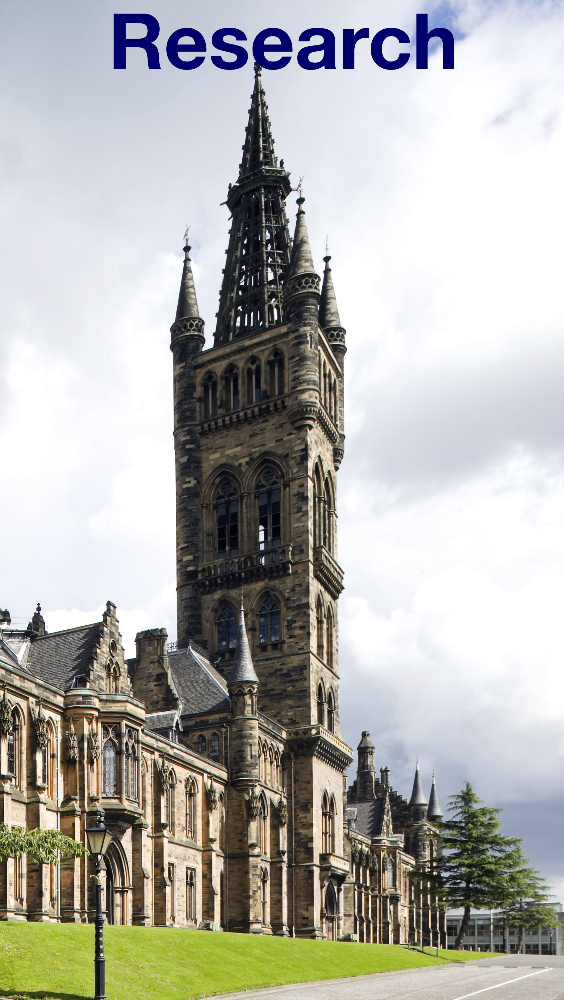

      

Postgraduate student at [Institute of Neuroscience and Psychology](http://www.gla.ac.uk/researchinstitutes/neurosciencepsychology/), [University of Glasgow](https://www.gla.ac.uk/), with [Lisa DeBruine](https://github.com/debruine)

 
       

       
 